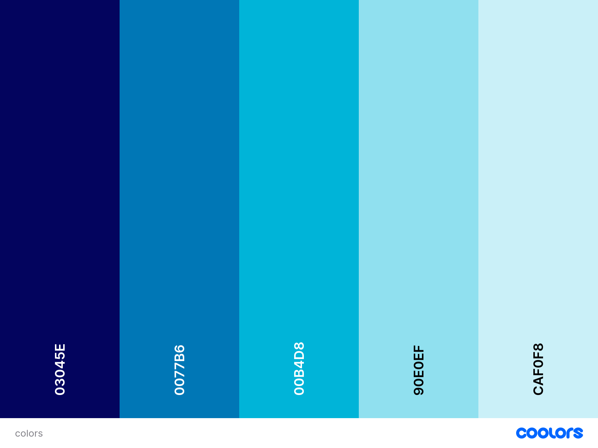

# Quiz Game

## Project Description

Test your knowledge by taking different quizes, you can choose different and choose categories and become better each time.

## Contents

- [Rationale](#rationale)

  - [Main Purpose](#main-purpose)
  - [User Goals](#user-goals)
  - [User Stories](#user-stories)
  - [Website Goals and Objectives](#website-goals-and-objectives)
  - [Target Audience](#target-audience)

- [Designs](#design)
  - [Wireframes](#wireframes)
  - [Design](#design)
  - [Typography](#typography)
  - [Colors](#colors)
- [Technologies Used](#technologies-used)
  - [Languages](#languages)

# Rationale

I wanted to create this application so people can test there knowladge while having fun and learning.

## Main Purpose

- To create a quiz that people can test there knowledge.
- To pratice if they play quiz games.
- To try and beat there highscore and have some fun.
- I created this quiz game for people to have some fun and learn something new aswell.

[Back to the Top](#contents)

## User Goals

- User friendly navigation.
- Easy to use and read.
- Make sure each section is correct.
- User accessibility needs.
- Clear infomation written in English.

[Back to the Top](#contents)

## User Stories

- As a user, I want to understand how to play.
- As a user, I want to able to read all infomation about the game.
- As a user, I want to choose from easy, medium to hard.
- As a user, I want to choose categories.
- As a user, I want to learn something new.
- As a user, I want the content to be accessible with anyone with needs.
- As a user, I want it see it working on all devices.

[Back to the Top](#contents)

## Website Goals and Objectives

- Make it fun to play.
- Adding different categories to it.
- Allowing users to choose difficulty.
- Making it easy to navigate around the website.
- Making sure everyone can access it with people have needs.
- Attracting people from all over the world to play the game.

[Back to the Top](#contents)

## Target Audience

- People who like to play quizes.
- Casual players.
- Students who wants to learn something new.

[Back to the Top](#contents)

# Design

Showing all the designs for the website.

## Wireframes

Wireframes was designed by using Balsamiq Wireframes, I followed best practice by doing Mobile version first then Tablet then follow with Desktop.

[Mobile Wireframe](docs/wireframes/Mobile.png "Mobile Wireframe")

[Tablet Wireframe](docs/wireframes/Tablet.png "Tablet Wireframe")

[Desktop Wireframe](docs/wireframes/Desktop.png "Desktop Wireframe")

[Back to the Top](#contents)

## Design

I have chosen this design because it makes it modern and fits well to a quiz game.

[Back to the Top](#contents)

## Typography

The font family I have choosen is [Lato](https://fonts.google.com/specimen/Lato "Lato") because it makes it feel modern while matching the theme.

[Back to the Top](#contents)

## Colors

[Back to the Top](#contents)

# Technologies Used

Shows all Languages, Libraries and tools used within this project.

## Languages

- HTML
- CSS
- JavaScript
