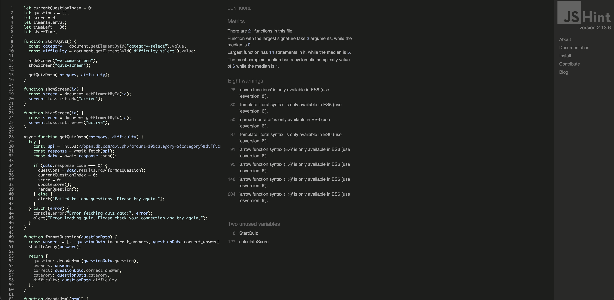

# Quiz Game

## Project Description

Test your knowledge by taking different quizes, you can choose different and choose categories and become better each time.

## Contents

- [Rationale](#rationale)

  - [Main Purpose](#main-purpose)
  - [User Goals](#user-goals)
  - [User Stories](#user-stories)
  - [Website Goals and Objectives](#website-goals-and-objectives)
  - [Target Audience](#target-audience)

- [Designs](#design)
  - [Wireframes](#wireframes)
  - [Design](#design)
  - [Typography](#typography)
  - [Colors](#colors)
- [Technologies Used](#technologies-used)
  - [Languages](#languages)
  - [Libraries](#libraries)
  - [Tools](#tools)
- [Testing](#testing)
  - [Responsiveness Testing](#responsiveness-tests)

# Rationale

I wanted to create this application so people can test there knowladge while having fun and learning.

## Main Purpose

- To create a quiz that people can test there knowledge.
- To pratice if they play quiz games.
- To try and beat there highscore and have some fun.
- I created this quiz game for people to have some fun and learn something new aswell.

[Back to the Top](#contents)

## User Goals

- User friendly navigation.
- Easy to use and read.
- Make sure each section is correct.
- User accessibility needs.
- Clear infomation written in English.

[Back to the Top](#contents)

## User Stories

- As a user, I want to understand how to play.
- As a user, I want to able to read all infomation about the game.
- As a user, I want to choose from easy, medium to hard.
- As a user, I want to choose categories.
- As a user, I want to learn something new.
- As a user, I want the content to be accessible with anyone with needs.
- As a user, I want it see it working on all devices.

[Back to the Top](#contents)

## Website Goals and Objectives

- Make it fun to play.
- Adding different categories to it.
- Allowing users to choose difficulty.
- Making it easy to navigate around the website.
- Making sure everyone can access it with people have needs.
- Attracting people from all over the world to play the game.

[Back to the Top](#contents)

## Target Audience

- People who like to play quizes.
- Casual players.
- Students who wants to learn something new.

[Back to the Top](#contents)

# Design

Showing all the designs for the website.

## Wireframes

Wireframes was designed by using Balsamiq Wireframes, I followed best practice by doing Mobile version first then Tablet then follow with Desktop.

[Mobile Wireframe](docs/wireframes/Mobile.png "Mobile Wireframe")

[Tablet Wireframe](docs/wireframes/Tablet.png "Tablet Wireframe")

[Desktop Wireframe](docs/wireframes/Desktop.png "Desktop Wireframe")

[Back to the Top](#contents)

## Design

I have chosen this design because it makes it modern and fits well to a quiz game.

[Back to the Top](#contents)

## Typography

The font family I have choosen is [Lato](https://fonts.google.com/specimen/Lato "Lato") because it makes it feel modern while matching the theme.

[Back to the Top](#contents)

## Colors

[Back to the Top](#contents)

## Color Variables

| Variable          | Color (HEX) | Notes                                                                  |
| ----------------- | ----------- | ---------------------------------------------------------------------- |
| --primary-color   | #03045E     | Dark navy for main text and structure                                  |
| --secondary-color | #CAF0F8     | Light blue for accent text                                             |
| --accent-color    | #00B4D8     | Bright blue for interactive elements                                   |
| --mid-primary     | #0077B6     | Medium blue for gradients and secondary actions                        |
| --soft-accent     | #90E0EF     | Light cyan for subtle backgrounds                                      |
| --white           | #FFF        | White used for text on dark backgrounds, button text, card backgrounds |
| --black           | #000        | Black used for text shadows and contrast elements                      |

# Technologies Used

Shows all Languages, Libraries and tools used within this project.

## Languages

- HTML
- CSS
- JavaScript

[Back to the Top](#contents)

## Libraries

- [Google Fonts](https://fonts.google.com/)
- [FontAwesome](https://fontawesome.com/)

[Back to the Top](#contents)

## Tools

- [Github](https://github.com)
- [Balsamiq](https://balsamiq.com/)
- [CDNJS](https://cdnjs.com/)
- [Am I Responsive](https://ui.dev/amiresponsive)
- [WAVE Accessibility Tool](https://wave.webaim.org/)
- [LightHouse](https://developer.chrome.com/docs/lighthouse/overview)
- [W3C HTML Validation Service](https://validator.w3.org/)
- [W3C CSS Validation Service](https://jigsaw.w3.org/css-validator/)
- [JSHINT](https://jshint.com/)

# Testing

## Responsiveness Tests

To test responsiveness I made sure to use mobile first approach and kept testing it using developer tools then after it was done I used [Responsive Design Checker](https://responsivedesignchecker.com/) to make sure it worked on multiple devices.

[Back to the Top](#contents)

When I was developing the website I was using Google Chromes Mobile Simulator to make sure it was working correctly and I have made it responsive by aligning each section and allowing the text and images to shirk to able to see and fit correctly.
| Size | Device Example | Navigation | Element Alignments | Content Placement | Functionality | Notes |
| ---- | ----------------------- | ---------- | ------------------ | ----------------- | ------------- | -------------------------------------------------------- |
| sm | Apple Iphone 3/4/4's | Good | Good | Good | Good | |
| sm | Samsung Galaxy S5/S6/S7 | Good | Good | Good | Good | |
| sm | Google Pixel | Good | Good | Good | Good | |
| md | Ipad Mini | Good | Good | Good | Good | |
| md | Samsung Galaxy Tab 10 | Good | Good | Good | Good | |
| md | Amazon Kindle | Good | Good | Good | Good | |
| lg | 10 Inch Notebook | Good | Good | Good | Good | |
| lg | 15 Inch Notebook | Good | Good | Good | Good | |
| xl | 20 Inch Desktop | Good | Good | Good | Good | |
| xl | 24 Inch Desktop | Good | Good | Good | Good | Make the contact form stand out more for bigger screens. |

# Code Validation

## HTML

I have used [W3C HTML Validation](https://validator.w3.org/). I have tested my 2 HTML pages and came back with no errors just 1 warning.

[Back to the Top](#contents)

## CSS

The CSS code was validated by using [W3C CSS Validation](https://jigsaw.w3.org/css-validator/). It returned back no errors.

[Back to the Top](#contents)

## JS Validation

The JS code was validated by using [JSHint](https://jshint.com/). It returned back no errors just a warning for ES6.

[Back to the Top](#contents)

## Accessibility Testing

I have used [WAVE](https://wave.webaim.org/) for accessibility I had 1 alert and 1 error.

[Back to the Top](#contents)

## Lighthouse Testing

I have used Lighthouse to test Perfomance, Accessibility, Best Practices, SEO

### Mobile

### Desktop

[Back to the Top](#contents)
